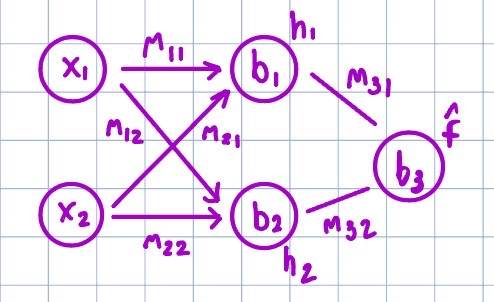

# XOR Problem with a Simple MLP in NumPy

This repository demonstrates training and inference for solving the **XOR (exclusive OR) problem** using a **Multilayer Perceptron (MLP)** implemented from scratch with NumPy.  

The project contains two Python scripts:
- **`train.py`** → trains the MLP on XOR and prints the learned weights, biases, and predictions.
- **`infrence.py`** → uses the trained weights and biases to perform forward inference on a new input.

---

## What is an MLP?

A **Multilayer Perceptron (MLP)** is a type of artificial neural network consisting of layers of interconnected nodes:
- **Input layer** (takes in features, e.g., `x1`, `x2`).
- **Hidden layer(s)** with nonlinear activation functions (e.g., ReLU, Leaky ReLU, Sigmoid).
- **Output layer** producing the final prediction.

MLPs are powerful because they can learn **nonlinear decision boundaries**, making them capable of solving problems that a single linear classifier cannot.

---

## What is the XOR problem?

The **XOR (exclusive OR)** problem is a classic benchmark in machine learning.  
It takes two binary inputs and outputs:
- `0 XOR 0 = 0`
- `0 XOR 1 = 1`
- `1 XOR 0 = 1`
- `1 XOR 1 = 0`

Why is it important?
- The XOR problem cannot be solved with a single linear classifier because its classes are **not linearly separable**.
- This makes it a canonical example proving the necessity of **hidden layers** in neural networks.

---

## MLP Architecture

The network used here is a **2–2–1 MLP**:
- 2 input neurons (`x1`, `x2`)
- 2 hidden neurons (Leaky ReLU activation)
- 1 output neuron (Leaky ReLU activation during training)

Here’s a visual representation of the 2–2–1 MLP used in this project:



---

## Files in this repo

### **`train.py`**
- Builds a 2–2–1 MLP (2 inputs → 2 hidden neurons → 1 output).
- Uses **Leaky ReLU** activation for both hidden and output layers.
- Trains on the XOR truth table using gradient descent and backpropagation.
- Prints the **final predicted values**, **weights**, and **biases** after training.

### **`infrence.py`**
- Loads the final trained weights and biases.
- Runs forward propagation for a given `(x1, x2)` input.
- Prints the predicted output.

### **`/public`**
- Holds extra images for rough work and diagrams

---

## Final Training Results

After training, the network successfully learns XOR:

```
Final predicted value is
 [-0.00115733]
 [ 0.99055087]
 [ 0.99055087]
 [ 0.00400041]

Final weights for layer 1 are
 [-1.14982244 -1.14982243]
 [-1.6631927  -1.6631927 ]

Final biases for layer 1 are
 [2.29948808 1.66131385]

Final weights for layer 2 are
 [ 2.58761599 -2.38728327]

Final biases for layer 2 are
 [-1.97479652]
```

The predictions are very close to the expected XOR outputs:
```
Input  =  Predicted Output
0,0    =  ~0
0,1    =  ~1
1,0    =  ~1
1,1    =  ~0
```

---

## How to Run

1. Clone this repo:
   ```bash
   git clone https://github.com/michaeltrbo/mlp-xor-problem.git
   cd mlp-xor-problem
   ```

2. Run training:
   ```bash
   python train.py
   ```

3. Run inference (example with `x1=1`, `x2=0`):
   ```bash
   python infrence.py
   ```

---

## Key Takeaways
- The XOR problem shows why **nonlinear activations** and **hidden layers** are essential.
- Even with a simple 2–2–1 architecture, an MLP can learn XOR from scratch.
- This project demonstrates the **fundamentals of forward propagation, backpropagation, and gradient descent** without relying on frameworks like TensorFlow or PyTorch.
